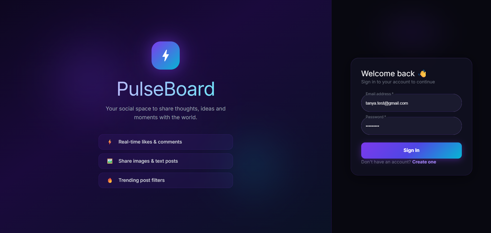
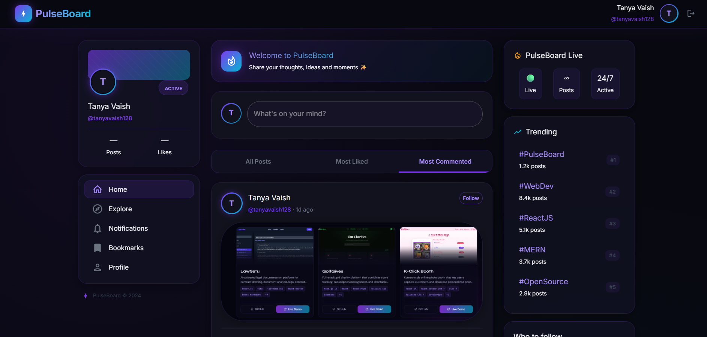

# ⚡ PulseBoard

> A modern full-stack social post application inspired by TaskPlanet's social feed — built with the MERN stack.


---

## 🌐 Live Demo

| Service | URL |
|---|---|
| 🚀 Frontend | [https://pulseboard-tan.vercel.app](https://pulseboard-tan.vercel.app) |
| 🔧 Backend API | [https://pulseboard-weyg.onrender.com](https://pulseboard-weyg.onrender.com) |
| 📦 GitHub Repo | [https://github.com/TanyaVaish-17/pulseboard](https://github.com/TanyaVaish-17/pulseboard) |

---

## 📸 Screenshots

### Login Page


### Feed Page


---

## ✨ Features

### Core Features
- 🔐 **Authentication** — Signup & Login with email/password using JWT
- 📝 **Create Posts** — Post text, image, or both (either one is enough)
- 🌍 **Public Feed** — All posts from all users visible in real-time
- ❤️ **Like Posts** — Toggle like with instant UI update + see who liked
- 💬 **Comment** — Add comments with username & handle saved
- 👤 **Auto Handle** — @handle auto-generated from name on signup

### Bonus Features
- 🔥 **Filter Tabs** — All Posts / Most Liked / Most Commented
- 📄 **Pagination** — Page dots + Load More with page indicator
- 🖼️ **Image Preview** — Preview image before posting
- ✍️ **Character Counter** — 500 char limit with live countdown
- #️⃣ **Hashtag Highlights** — #tags and @mentions highlighted in posts
- ⏱️ **Time Ago** — "6 hours ago", "2 days ago" display
- 📱 **Mobile Responsive** — Bottom nav bar on mobile, sidebars on desktop
- 🎨 **3-Column Layout** — Profile sidebar + Feed + Trending sidebar
- 💜 **Dark UI** — Glassmorphism cards, gradient accents, glow effects

---

## 🛠️ Tech Stack

| Layer | Technology |
|---|---|
| Frontend | React.js (Vite) |
| UI Library | Material UI (MUI) |
| Backend | Node.js + Express.js |
| Database | MongoDB Atlas |
| Authentication | JWT + bcryptjs |
| Image Upload | Cloudinary + Multer |
| Frontend Deploy | Vercel |
| Backend Deploy | Render |

---

## 📁 Project Structure

```
pulseboard/
├── frontend/                  # React Vite app
│   ├── src/
│   │   ├── components/        # Reusable components
│   │   │   ├── Navbar.jsx
│   │   │   ├── PostCard.jsx
│   │   │   ├── CreatePost.jsx
│   │   │   ├── LeftSidebar.jsx
│   │   │   ├── RightSidebar.jsx
│   │   │   └── BottomNav.jsx
│   │   ├── pages/             # Page components
│   │   │   ├── Login.jsx
│   │   │   ├── Signup.jsx
│   │   │   └── Feed.jsx
│   │   ├── context/           # Auth context
│   │   │   └── AuthContext.jsx
│   │   ├── utils/             # Axios instance
│   │   │   └── api.js
│   │   ├── theme.js           # MUI dark theme
│   │   ├── App.jsx
│   │   └── main.jsx
│   └── package.json
│
└── backend/                   # Node.js Express API
    ├── config/
    │   ├── db.js              # MongoDB connection
    │   └── cloudinary.js      # Cloudinary config
    ├── controllers/
    │   ├── authController.js  # Signup & Login logic
    │   └── postController.js  # Post CRUD logic
    ├── middleware/
    │   └── auth.js            # JWT protect middleware
    ├── models/
    │   ├── User.js            # User schema
    │   └── Post.js            # Post schema
    ├── routes/
    │   ├── authRoutes.js      # /api/auth
    │   └── postRoutes.js      # /api/posts
    ├── server.js
    └── package.json
```

---

## 🗄️ MongoDB Collections

Only **2 collections** used as per requirements:

### `users`
```json
{
  "name": "Tanya Vaish",
  "handle": "@tanyavaish140",
  "email": "tanya@example.com",
  "password": "<hashed>",
  "avatar": ""
}
```

### `posts`
```json
{
  "user": "<userId>",
  "username": "Tanya Vaish",
  "handle": "@tanyavaish140",
  "text": "Hello PulseBoard! #MERN",
  "image": "<cloudinary_url>",
  "likes": ["<userId>"],
  "likedUsernames": ["Tanya Vaish"],
  "comments": [
    {
      "user": "<userId>",
      "username": "Rahul Dev",
      "handle": "@rahuldev99",
      "text": "Great post!"
    }
  ]
}
```

---

## 🚀 Local Setup

### Prerequisites
- Node.js v18+
- MongoDB Atlas account
- Cloudinary account

### 1. Clone the repo
```bash
git clone https://github.com/TanyaVaish-17/pulseboard.git
cd pulseboard
```

### 2. Backend setup
```bash
cd backend
npm install
```

Create `backend/.env`:
```
MONGO_URI=your_mongodb_atlas_uri
JWT_SECRET=your_jwt_secret
PORT=5000
CLOUDINARY_CLOUD_NAME=your_cloud_name
CLOUDINARY_API_KEY=your_api_key
CLOUDINARY_API_SECRET=your_api_secret
FRONTEND_URL=http://localhost:5173
```

```bash
npm run dev
```

### 3. Frontend setup
```bash
cd frontend
npm install
```

Create `frontend/.env`:
```
VITE_API_URL=http://localhost:5000/api
```

```bash
npm run dev
```

### 4. Open app
Visit `http://localhost:5173` 🚀

---

## 📡 API Endpoints

### Auth
| Method | Endpoint | Description |
|---|---|---|
| POST | `/api/auth/signup` | Register new user |
| POST | `/api/auth/login` | Login user |

### Posts
| Method | Endpoint | Description | Auth |
|---|---|---|---|
| GET | `/api/posts` | Get all posts (paginated) | ✅ |
| POST | `/api/posts` | Create new post | ✅ |
| PUT | `/api/posts/:id/like` | Toggle like | ✅ |
| POST | `/api/posts/:id/comment` | Add comment | ✅ |

### Query Params for GET /api/posts
```
?filter=all          # default
?filter=mostLiked    # sort by most likes
?filter=mostCommented # sort by most comments
?page=1&limit=10     # pagination
```

---

## 🔐 Authentication Flow

```
Signup → JWT Token issued → Stored in localStorage
Login  → JWT Token issued → Stored in localStorage
All protected routes → Bearer token in Authorization header
Logout → Token cleared from localStorage
```

---

## 🏆 Bonus Points Implemented

- ✅ Clean and modern UI (dark glassmorphism theme)
- ✅ Responsive and optimized layout (mobile + desktop)
- ✅ Efficient pagination logic (page dots + load more)
- ✅ Well-structured and reusable code (components, controllers, routes)
- ✅ Code comments and best practices

---

## 👩‍💻 Author

**Tanya Vaish**
- 🎓 B.Tech CSE — KIET Group of Institutions
- 📧 tanyavaish05@gmail.com
- 🐙 [@TanyaVaish-17](https://github.com/TanyaVaish-17)

---

## 📄 License

This project was built as part of the **3W Business Private Limited** Full Stack Internship Round 1 Task.

---

<div align="center">
  <strong>Built with ❤️ by Tanya Vaish</strong>
</div>